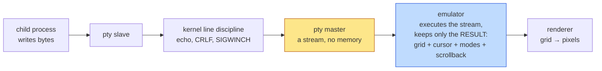
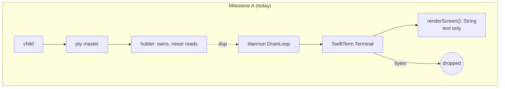
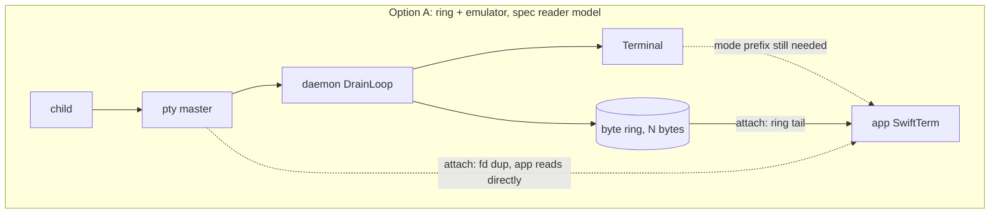
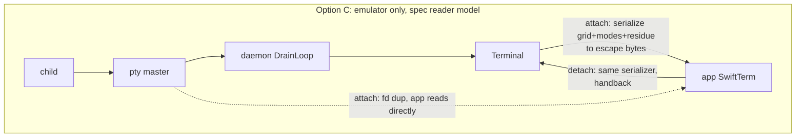
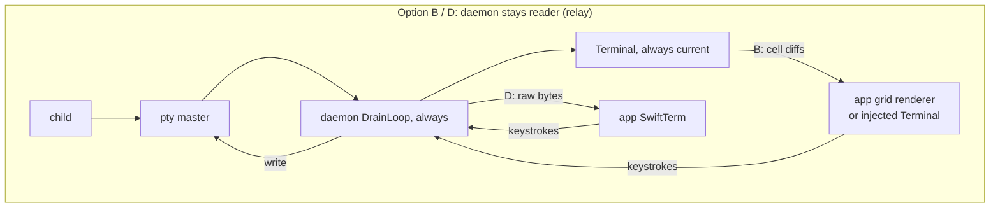

# What the daemon keeps per holder session, and what seeds the app at attach

An explainer for the Milestone B transport question: what the daemon retains for a
pty-holder session, and what it hands a viewer at attach. Companion to the design spec,
which decides the matter; this document exists to make that decision legible and to
record the alternatives and why they lose.

Everything here was checked against `origin/main` at `1a27a12e`, the `cheapsteak/SwiftTerm` checkout pinned in `Package.resolved` (`62d0be6d`), the approved spec `docs/specs/2026-08-30-pty-holder-session-transport-design.md`, and shallow clones of tmux and mosh. Where a number or claim could not be verified it says so inline.

## 0. The short version

- A **pty** carries a stream of bytes that is a *program* for drawing a screen. An **emulator** runs that program and holds the *result*: a grid of cells plus a bundle of modes. A **renderer** turns the grid into pixels. You can always get the result from the program; you cannot get the program back from the result. That asymmetry is the entire question.
- The daemon today runs a full SwiftTerm emulator per holder session and **throws the bytes away**. Its only outputs are two plain-text renders with no color, no bold, no cursor, no modes. Confirmed in `Sources/TBDDaemon/Holder/HolderReader.swift`.
- The approved spec already picks an answer for attach: the daemon **serializes its emulator's grid and modes back into escape sequences** (the "snapshot preamble"), the app feeds that into its own SwiftTerm, and then the app **reads the pty directly** — the daemon sends nothing live. That is Option C below, and the same shape TBD's existing tmux control-mode attach uses today (with tmux doing the serializing).
- Option A (keep raw bytes) looks free but is not: a byte ring that has wrapped has lost the one-time mode-setting sequences a TUI emits at startup, and replaying raw bytes re-executes side effects (terminal queries get answered a second time, straight into the child's input). It needs most of Option C's serializer anyway to be correct.
- Option B (ship cells) is the mosh design. It is the only option that gives one source of truth and survives an app crash with no gap, but it requires the daemon to stay the reader while a viewer is attached, which puts a daemon wakeup and a daemon parse back into every keystroke's echo path — the cost the whole holder migration exists to remove.
- **Recommendation: Option C, as the spec says, with two specific additions** — carry the parser's unfinished-sequence residue alongside the snapshot (tmux's `capture-pane -P` trick, which TBD's `ReplayWriter` already replays), and open a small set of read accessors in the SwiftTerm fork so the serializer, living in TBD, can reach the mode state that is not public. The honest argument against it is in section 8.

## 1. The problem from first principles

### Three different things that all get called "the terminal"

**The pty is a pipe with opinions.** When the holder calls `forkpty`, the kernel creates a pair of devices. The child process writes bytes to its end (the "slave"); whoever holds the other end (the "master") reads them. The kernel's line discipline sits between them and does small things — echoes typed characters, turns `\n` into `\r\n`, delivers `SIGWINCH` on resize — but it does not understand escape sequences. What comes out of the master is exactly what the program wrote, byte for byte, in order. It is a **stream**, and it has no memory: once a byte is read, it is gone from the kernel, which is why the holder never reads the master (`HolderReader.swift:13`, "a byte it consumed is a byte no reader can ever see again") and why draining is a liveness requirement (`HolderReader.swift:8-16`, a job cannot finish exiting while output sits unread).

**The emulator is an interpreter.** It reads that stream and executes it. Printable bytes become cells in a grid. Escape sequences are commands: move the cursor here, switch to red, clear from cursor to end of screen, scroll this region, switch to the alternate screen, turn on bracketed paste, report your cursor position back to me. After executing a sequence, the emulator does not keep it. What it keeps is the **state the sequence produced**: the grid of cells (each with its character and its attributes), the cursor position, a few dozen mode flags, the scroll region, the saved cursor, which of the two screens is active, the title, and a scrollback of lines that scrolled off the top.

**The renderer draws the grid.** SwiftTerm's `TerminalView` takes an immutable snapshot of the emulator's grid under the terminal lock (`.build/checkouts/SwiftTerm/Sources/SwiftTerm/Apple/TerminalSnapshot.swift`, "Immutable renderer input copied while Terminal.terminalLock is held") and paints it with CoreGraphics (or Metal, which TBD does not use — `Sources/TBDApp/Terminal/TerminalCommitLatencyProbe.swift:30`). Selection, find, link detection, copy — all of these are operations on the grid, not on the bytes.



### Why a byte stream and a grid are different kinds of thing

They are related the way source code and a running process's memory are related. The stream is a sequence of instructions; the grid is the machine state after running them. Two consequences follow, and both matter here.

**Running the stream is lossy.** A TUI like Claude Code repaints its screen many times a second. Every repaint overwrites the cells the last one wrote. The grid holds only the latest frame; the thousand frames before it are gone. A `clear screen` sequence destroys a screenful of cells. Output that scrolls past the scrollback limit is dropped. So the grid is much smaller than the stream that produced it, and you cannot reconstruct the stream from it.

**The grid is not enough to resume the stream.** Programs set modes once and rely on them. Claude Code, at startup, switches to the alternate screen (`ESC[?1049h`), turns on bracketed paste (`ESC[?2004h`), and typically hides the cursor and enables a few more; a full-screen editor sets a scroll region. Those sequences are emitted once and never again. They are not visible in the grid at all — they are flags in the emulator. If a fresh emulator gets the grid but not the flags, it will paint the right picture and then misbehave the moment the user interacts: a paste arrives unbracketed (so a multi-line paste into Claude Code submits on each newline), the next `ESC[?1049l` on exit does not restore the primary screen, arrow keys are encoded the wrong way.

So there are really **two payloads**: the cells (what is on screen), and the state (how to keep behaving correctly). Any transport has to carry both, and the options differ in *where each one comes from*.

### What "attribute-free plain text" concretely means

Suppose the child wrote these bytes to the pty (shown with `ESC` for the 0x1B byte):

```
ESC[1;31mError:ESC[0m disk full\r\n
ESC[2mfetching…ESC[0m ESC]8;;https://acme.example/docs\aESC[4mdocsESC[0mESC]8;;\a\r\n
ESC[?25lESC[3;1H▶ ESC[7m run ESC[0m
```

Read that as: bold red "Error:", then normal "disk full"; a dim "fetching…", a hyperlink whose visible text is an underlined "docs"; hide the cursor, jump to row 3 column 1, print an arrow and an inverse-video " run ".

The daemon's emulator executes all of it. The grid now holds cells with bold+red, dim, underline, and inverse attributes, one cell run carries an OSC 8 hyperlink payload, the cursor is hidden at (3, 8). Then the daemon discards the bytes.

Ask the daemon for the screen — `renderScreenWithScrollback(maxLines:)` in `HolderReader.swift:898-912`, which calls `BufferLine.translateToString(trimRight: true)` on each line — and you get exactly this:

```
Error: disk full
fetching… docs
▶  run
```

No red, no bold, no dim, no underline, no inverse, no link URL, no cursor position, no "cursor is hidden", no "we are on the alternate screen", no bracketed-paste flag. `translateToString` walks the cells and appends characters (`BufferLine.swift:777`); it never looks at `Attribute`. This is fine for what it is used for today — `terminal.output` for machine reads (`RPCRouter+TerminalHandlers.swift:1857` on `origin/main`) — and it is useless as an attach seed for an interactive terminal. Confirmed: those two methods (`renderScreen`, `renderScreenWithScrollback`) are the only ways out of the daemon's emulator, and both return `String`.

The grid itself, however, still has everything. SwiftTerm stores each cell as a `PackedCell`, a single `UInt64` carrying the character (or a grapheme id), a 16-bit style id into a per-terminal `CellArena` that interns each distinct `Attribute` once, a width state (narrow, wide, spacer), a protected bit, a 16-bit payload id (hyperlinks), and 3 bits of OSC 133 semantic marking (`CellStorage.swift:16-51`). The attributes are `fg`/`bg` as `ansi256(code)`, `trueColor(r,g,b)`, or default (`CharData.swift:69-81`), plus an 8-bit `CharacterStyle` of bold, underline, blink, inverse, invisible, dim, italic, crossedOut (`CharData.swift:35-50`). So the information survived the parse; only the *render* dropped it.

## 2. Why there are two emulators, and why that is not a bug

The daemon's emulator exists for three reasons, and none of them is "someone is looking at it".

- **Somebody has to consume the bytes, and consuming means interpreting or storing.** The drain loop must read the master unconditionally (the liveness argument above). Once read, the bytes either go into something that understands them (an emulator), something that stores them verbatim (a ring — Option A), or the void. The daemon chose to understand them, so that it can answer questions without replaying.
- **Machine reads.** `terminal.output`, the supervision babysitter, the hibernation input-veto rail, the interactive-login driver — all need "what is on this session's screen right now" while no viewer is attached. The spec (lines 566-571) routes these to the daemon's emulator when the daemon is the reader, and to a pull from the app when a viewer is attached. A plain-text render is exactly right for this consumer.
- **The attach seed.** When a viewer opens a session that has been running unattended for an hour, the user expects to see the screen the agent left, not a blank pane waiting for the next repaint. That picture has to come from wherever the detached-period bytes went.

The app's emulator exists because the app has to paint pixels, take keystrokes, run selection and find, and do all of that at 0.1 ms echo latency with no process in between — the spec's central claim (lines 82-85). It has to run the same parser the daemon runs, or the two pictures can disagree on interpretation (the spec's argument for SwiftTerm headless over a minimal parser, lines 428-435).

Two emulators are therefore two *roles*, not duplicated work: one is a store-and-answer machine for the fleet, the other is a paint-and-interact machine for the one session the user is in. At fleet scale the daemon's is the majority store: the app keeps at most `keepAliveLimit = 8` non-protected worktree views mounted (`Sources/TBDApp/AppState.swift:958`, plus whatever is selected or actively working), so with 150 sessions roughly 130+ of them have only the daemon's emulator.

What is genuinely awkward is not the count but the **hand-off between them**: at attach, the app's emulator must be brought to the state the daemon's is in, and at detach, the reverse. That is what the three options are about.

## 3. The reader model, which the spec already settles

It is natural to assume the daemon must send the app enough to paint the screen and then keep it updated live. The approved spec answers the second half differently: **the daemon does not keep the app updated at all.** At attach it quiesces, snapshots, sends the snapshot plus a `dup` of the pty master over the FD sidecar, and then steps off the fd entirely. The app reads the master itself for as long as it is attached (spec lines 82-85 and 244-262). The daemon's emulator is *frozen* for the duration and re-seeded from the app's own snapshot at detach (lines 263-278, 490-533).

This splits the question into two that are worth keeping apart:

- **Who reads the pty while a viewer is attached?** The spec says the app, directly. Keeping this is what makes echo flat under load. Changing it to "the daemon reads and relays" is a change to the spec's core, not a transport detail.
- **What does the daemon keep per session, and what seeds the app at attach (and the daemon at detach)?** This is the open question, and Options A and C are answers to it that keep the spec's reader model. Option B is only possible if the daemon *stays* the reader, so choosing B is also choosing to relay.

The rest of this document treats each option under the spec's reader model, and says explicitly where an option forces the relay model instead.

## 4. The options

### Where things stand today (Milestone A, on `origin/main`)

```
  child ──pty──▶ holder (owns master, never reads)
                    │ dup over SCM_RIGHTS
                    ▼
                 daemon: DrainLoop ──▶ HolderEmulator (SwiftTerm Terminal,
                                        5,000-line scrollback) ──▶ bytes dropped
                                        │
                                        └─▶ renderScreenWithScrollback() : String
                                             (terminal.output, machine reads only)

  app: knows nothing. TerminalPanelView.transportPreparationNotice(for: .holder)
       shows "This session runs on the pty-holder transport, which TBD can't
       display yet." (TerminalPanelView.swift:33-34, :527-532). Every `holder`
       hit in RPCProtocol.swift is a config setter (lines 293-295, 342);
       no RPC method carries session output. terminal.send refuses holder rows.
```

The app is transport-blind and the pane is the entire blast radius (`docs/specs/2026-09-01-holder-app-gap-findings.md` established this by driving the real app).

### Option A — keep a bounded ring of raw pty bytes alongside the emulator

**What gets stored.** The emulator as today, plus a ring buffer of the last N bytes read from the master, per session, appended in `DrainLoop.drainEverythingReadable` next to `emulator.feed`.

**What crosses the wire at attach.** The ring's contents (tail), then the fd. The app feeds the tail into its SwiftTerm and goes live on the fd.

**What crosses during use.** Under the spec's model, nothing — the app is on the fd. Under a relay model, the daemon forwards each chunk it reads.

**Code to write.** A ring (small), a wire frame for "here is the seed" (the FD sidecar already has `fdVend`/`input`/`paste` frame kinds in `Sources/TBDShared/SidecarFraming.swift:13-15`; a fourth is needed under any option), and an app consumer — `ControlModeStreamReader` plus `feed(byteArray:)` is already that consumer for the tmux control-mode path (`TerminalPanelView.swift:1070, 1379`).

**What the user sees on attach.** If the ring has not wrapped since the session started, a perfect reconstruction — same bytes, same parser, same grid, same modes. If it *has* wrapped, the app's emulator starts from a blank primary screen and executes a stream that begins at an arbitrary byte. For a full-screen TUI the picture usually becomes right at the next full repaint inside the tail (Claude Code repaints with absolute positioning), but it is painted into the **wrong emulator state**: the app's SwiftTerm never saw the `ESC[?1049h` / `ESC[?2004h` / cursor-hide / mouse-mode sequences from startup, because they left the ring long ago. That is the failure described in section 1: correct pixels, wrong behavior — unbracketed paste, no primary-screen restore on exit, TUI frames polluting the primary scrollback. For a plain shell the first visible line is truncated mid-way and the scrollback is whatever fits in N bytes.

**How it fails when it fails.** Three ways, all silent.

- **Modes are lost on wrap**, as above. Fixing this needs a mode prefix synthesized from the emulator — which is the state half of Option C's serializer. tmux does exactly this on every attach (`tty_update_mode`, tmux `tty.c:884`, which clears and re-sets all mouse modes because "there are differences in how terminals track the various bits").
- **Replayed bytes re-execute side effects.** The daemon's emulator answers terminal queries on behalf of the child — cursor-position reports, device attributes, `DECRQM` — by writing replies back down the pty (`HolderReader.swift:126-134`, `ReplyForwardingDelegate`). If the app replays the same bytes into its own SwiftTerm, whose delegate `send` writes to the pty, every query in the tail is **answered a second time, typed into the child as input** (a stray `ESC[24;80R` arriving at a shell prompt is keystrokes). The bell rings again; TBD's OSC 777 notification parser (`TBDTerminalView.parseNotifyPayload`) fires again. Whether Claude Code issues such queries at startup was not verified, but any program that does is exposed. tmux's `capture-pane -e` sidesteps this by construction: it emits only SGR and text.
- **The ring and the emulator disagree on how much history exists.** The ring is bounded in bytes, the emulator in lines. A colorful `git log` might cost 200 bytes per line (unverified; depends on the program), so a 1 MB ring holds ~5,000 such lines — about the emulator's limit — but a session that streamed a large plain-text file holds far more lines than bytes-per-line suggests, and a TUI at, say, 10-20 KB per repaint (unverified) fills 1 MB in a few dozen frames, i.e. seconds. A fresh attach can therefore show *less* scrollback than the daemon knows about, and the amount varies by workload in a way the user cannot predict.

**Where A is genuinely strong.** It is the only option whose fidelity is automatically complete for anything the parser learns in future — new SGR forms, kitty keyboard flags, images. And the ring is a good *diagnostic* (replay the exact bytes that produced a rendering bug) independent of transport.

### Option B — the daemon owns the only emulator and ships cells or grid diffs

**What gets stored.** The emulator as today, and nothing else. The daemon stays the reader forever.

**What crosses the wire.** At attach, the full grid (cells with resolved attributes, cursor, the mode flags the app needs to encode input). During use, per-line diffs whenever the grid changes, throttled to the app's ability to consume them.

**Code to write.** This is the largest option, and it reaches into three places.

- **A cell wire format and a diff engine in the daemon.** `PackedCell` ids are arena-relative (style id, grapheme id, payload id), so the wire either ships arena entries alongside cells or expands each cell to its resolved attribute. SwiftTerm's fork already tracks per-line `generation` counters and `getScrollInvariantUpdateRange()` (`Terminal.swift:6783`) for render invalidation, so "which lines changed" is cheap; "the whole screen scrolled by one" is the classic hard case (mosh's `Display::new_frame` spends most of its effort on row moves and erase heuristics, `mosh-src/src/terminal/terminaldisplay.h`).
- **A grid consumer in the app.** Either a new renderer that draws cells (rebuilding selection, find, link detection, copy, drag-and-drop targets, paste interception, click-passthrough, the OSC 777 hook — everything in `Sources/TBDApp/Terminal/TBDTerminalView.swift` and the SwiftTerm view it subclasses), or fork surgery to write received cells straight into the app's `Terminal.buffer` (`BufferLine.setPackedCell`, `copyFrom` — internal APIs) so the existing view keeps working. The second is more tractable than it sounds, but every mode that affects **input encoding** (`applicationCursor`, `bracketedPasteMode`, `mouseMode`, kitty keyboard state) must also be shipped and set, because the app's `TerminalView` encodes keystrokes from its own `Terminal`'s flags, and those are `private(set)` (`Terminal.swift:588, 908`).
- **A different reader model.** The daemon never hands the fd to the app. Keystrokes go app → daemon → pty; echo goes pty → daemon (read, parse) → diff → app. This deletes the hardest code in the spec (quiesce, acked fd vend, the liveness gates on attach, app-death seizure, handback at detach) and replaces it with a per-byte relay.

**What the user sees.** A correct picture always, with one source of truth. On app crash: nothing lost, because the daemon never stopped. After reconnect: identical.

**How it fails when it fails.** On latency and CPU, which is what the migration is about. Every keystroke's echo now wakes the daemon and runs SwiftTerm's parser there before the app hears about it — one wakeup and one parse instead of tmux's two wakeups and one parse. The spec's measurements (lines 23-47) attribute tmux's superlinear degradation under load to scheduling delay per wakeup; halving the wakeups is better than tmux, but it is not the flat curve of a raw pty, and the graduation gate (lines 838-868) demands flatness within 2× of idle. Option B would need that gate re-derived. It also puts the daemon's parse on the path for every attached session's output — the "parsed twice" bandwidth cost the spec names at line 60.

**Where B is genuinely strong.** Diffs are idempotent and coalescable: if the app is asleep under App Nap for 90 seconds, the daemon sends one diff when it wakes, not 90 seconds of bytes. This is mosh's reason for existing on lossy links; on a local unix socket the same property makes a backgrounded app cheap. And there is no handback problem at all.

### Option C — keep only the emulator; write a serializer that turns grid + state back into escape sequences

**What gets stored.** The emulator as today, unchanged. Nothing new per session.

**What crosses the wire at attach.** A byte stream the daemon *generates* from its grid: a reset prelude, the scrollback lines and screen lines as text with SGR runs, the mode flags as DECSET/DECRST, the scroll region, the alt-screen switch and alt content if active, the cursor position. Then the fd. The app feeds the stream into SwiftTerm and goes live.

**What crosses at detach.** The same thing in reverse, generated by the app from its SwiftTerm, so the daemon's frozen emulator is brought current (spec lines 263-278). One serializer, two directions.

**Code to write.** The serializer, and a round-trip test. Nothing in TBD does this yet, but two nearby things show its exact shape:

- **TBD's own tmux control-mode attach is Option C with tmux as the serializer.** `PaneCaptureReplay.captureCommands` (`Sources/TBDDaemon/Tmux/ControlMode/PaneCaptureReplay.swift:35-64`) asks tmux for `capture-pane -peqJN` (`-e` = with escape sequences) for history, screen, and saved-primary legs, `list-panes -F` for state, and `capture-pane -p -P -C` for pending bytes. `ReplayWriter.assemble` (`ReplayWriter.swift`) emits reset prelude → history → mode escapes → DECSTBM → `ESC[?1049h` + alt content → pending bytes → CUP, with comments recording the SwiftTerm quirks it had to accommodate (the alt-screen region must come after the switch; `1049h` needs a home). `PaneStateCapture` lists the state it carries: cursor, saved cursor, alt flag, insert/origin/wrap/cursor-visible, application cursor and keypad, four mouse flags, scroll region. The app consumes it through `ControlModeStreamReader` → `feed(byteArray:)`. The daemon's default history depth for that replay is 50,000 lines (`AttachReplayOrchestrator.swift:156`).
- **tmux's emitter is ~250 lines of C.** `grid_string_cells` (`tmux-src/grid.c:1180`) walks cells, and `grid_string_cells_code` computes the SGR *delta* from the previous cell so a run of same-styled text costs one escape, adds OSC 8 for hyperlinks, and skips padding cells behind wide characters. iTerm2 consumes this same output when it attaches to tmux (`sources/tmux/TmuxWindowOpener.m:280`, `capture-pane -peqJ%@ … -S -%d`), parsing it through its own VT100 parser into screen lines (`TmuxHistoryParser.m`).

So the serializer to write is "tmux's `grid_string_cells` plus TBD's `ReplayWriter`, reading SwiftTerm's `Terminal` instead of tmux's grid". Concretely it reads, per line: `BufferLine.getData()` → `[CharData]` with `attribute.fg/bg/style`, `width` (skip spacer tails), the grapheme `Character`, `payload` → `TinyAtom.target` for the hyperlink URL, `isWrapped` (emit exactly `cols` characters with no CR LF so DECAWM re-wraps, the way `-J` does). Per terminal: `buffer.x/y`, `buffer.scrollTop/scrollBottom`, `buffer.marginLeft/Right`, `buffer.savedX/savedY/savedAttr`, `isCurrentBufferAlternate`, `applicationCursor`, `applicationKeypad`, `bracketedPasteMode`, `mouseMode` and its encoding, `cursorHidden`, `originMode`, `insertMode`, `wraparound`, `reverseWraparound`, `sendFocus`, `terminalTitle`. Several of those are internal or `private(set)` in `Terminal.swift` (`applicationKeypad:514`, `cursorHidden:556`, `originMode:559`, `insertMode:564`, `wraparound:566`, `curAttr:612`, `mouseProtocol:770`), and the parser itself is `private` (`:640`). The cells, by contrast, are fully reachable through public API (`BufferLine.getData()`, `CharData.attribute`, `.width`, `.getCharacter()`, `.getPayload()`, `.semanticContent`, `BufferLine.isWrapped`). So the fork needs a small read-only accessor surface for the mode state — not the serializer itself, which can live in TBD (the checkout's last commit is already a TBD-motivated visibility change of exactly this kind).

**What the user sees on attach.** The screen the daemon had, with colors, styles, links, cursor, and modes, painted instantly, then live. Scrollback to the emulator's 5,000-line limit, in lines, regardless of how many bytes produced them.

**How it fails when it fails.** By omission. Anything the grid holds but the serializer forgets to emit is silently missing at attach and — worse — silently missing from the daemon's emulator after every detach, because the handback uses the same code. Specific fidelity limits, each checked against the fork:

- **Parser residue.** If the last chunk the daemon drained ended mid-sequence (`ESC[3` with `1m` still to come), the parser's partial state is not in the grid. Under the spec's fd handoff, the app's fresh parser then reads `1m` and prints it as text. tmux solved this with `capture-pane -P` (pending output), and `ReplayWriter.unescapePending` already replays it for tmux. SwiftTerm's `EscapeSequenceParser` keeps this state privately; exposing "bytes since the parser last returned to ground" is a small fork change and the one place Option C needs a few raw bytes. Skipping it costs an occasional one-off glitch until the next repaint.
- **Wrapped lines and wide characters at the wrap column.** The `isWrapped` flag is public; a double-width character sitting on the boundary needs the same care tmux's padding-skip takes. Testable.
- **Combining characters and grapheme clusters.** Stored in the arena and returned as a `Character`; serialize the character, not the scalar. The arena caps interned graphemes at 65,535 per terminal and degrades new ones to their first scalar past that (`CellStorage.swift:290-294`) — a pre-existing emulator limit, not a serializer one.
- **Hyperlinks.** Carried as a 16-bit payload id resolved through `TinyAtom` (`CharData.swift:190`); emit OSC 8 open/close around runs. tmux does the same.
- **Images (kitty, sixel), OSC 133 semantic marks, per-cell protected bits.** Semantic marks are 3 bits in the cell and could be re-emitted as OSC 133; images would be lost. Both are acceptable for the dominant workload and can be added later without changing the transport.
- **Colors and styles.** `ansi256` → `38;5;n`, `trueColor` → `38;2;r;g;b`, default → `39`/`49`; eight style bits map one-to-one to SGR 1/2/3/4/5/7/8/9. The fork's `Attribute` also carries `underlineStyle` (single, double, curly, dotted, dashed) and an optional `underlineColor` (`CharData.swift:53-60, 109-115`), which map to SGR `4:n` and `58;…`. There is an internal `Attribute.toSgr()` (`CharData.swift:133`) that covers bold/underline/blink/inverse/invisible and colors but not dim, italic, crossed-out, underline style or underline color — a starting point, not a finished emitter.
- **Cursor style and blink**, `DECSCUSR`; **title**, OSC 2. Both available.
- **Bracketed paste.** Public and serializable here — an improvement on the tmux path, which cannot synthesize it because tmux exposes no flag (`ReplayWriter.swift:218-222`).

The round-trip test is the safety net that A cannot have: feed a corpus of real captured pty bytes into a `Terminal`, serialize, feed the result into a second `Terminal`, and compare the two grids cell by cell plus every mode flag. Any omission reddens. That test can also be run over the fork's own fixtures.

### Option D — the daemon stays the reader and relays bytes to the app (a fourth shape the code suggests)

This is not a storage choice but the relay reader model with Option C (or A) as the seed: the daemon keeps draining and parsing always, forwards each chunk to the attached app over the sidecar exactly as `PaneFanout` forwards tmux `%output` today, and the app's SwiftTerm parses it a second time. It is what the existing control-mode path *is*, with the holder in place of tmux.

It buys: no reader arbitration (delete quiesce, ack, liveness gates, handback); gapless daemon-side scrollback across attached periods (the spec accepts a hole today, lines 523-527); no loss on app crash; and the daemon's emulator is never stale for machine reads. It costs: one daemon wakeup plus one daemon parse on every keystroke's echo path — the same cost class as Option B, which is the cost the spec measured tmux paying and chose to remove. The spec rejects the mirror image (app streams to daemon, lines 996-1001) for exactly that CPU bill. D reopens a settled decision and should be seen as such; it is listed because if the relay model is ever chosen, D (bytes) is strictly simpler than B (cells) and keeps the whole app terminal surface intact.

## 5. Tradeoffs on named axes

### Memory per session

The numbers below are derived from the fork's layout, not measured in a running daemon. Cells are exactly 8 bytes (`PackedCell` is one `UInt64`, `CellStorage.swift:31`; `CellStoragePage` "owns the contiguous 8-byte cells for one terminal row", `:810`). The per-line `BufferLine` and `CellStoragePage` objects add an overhead I estimate at one to two hundred bytes per line from their stored properties (`BufferLine.swift:19-181`) — an estimate, not a measurement. The `[BufferLine?]` slot array is preallocated at `scrollback + rows` entries (`Buffer.swift:712, 820`), lines themselves are materialized only when written. The expanded `CharData` read-side value is several times larger than a stored cell; `MemoryLayout<CharData>.size` would settle its exact size and I did not compute it.

| Quantity | Value |
|---|---|
| Stored cell | 8 B |
| 120-column line, cells only | 960 B |
| 120-column line, with per-line objects (estimate) | ~1.1–1.2 KB |
| Slot array, 5,000 + 40 entries × 8 B | ~40 KB |
| Full 5,000-line scrollback, cells only | 4.8 MB |
| Full 5,000-line scrollback, all-in (spec's figure) | 5–6 MB |
| Alt-screen TUI that never scrolls, 40 × 120 viewport | ~40 KB + slot array |
| 150 sessions, worst case, emulator only | ~0.8 GB |
| Option A ring, per session, at 256 KB / 1 MB | 256 KB / 1 MB |
| Option A ring, 150 sessions, at 1 MB | 150 MB |
| Option B / C / D extra per session | 0 |

Option C is the only one that adds nothing. Option A's ring is modest but is *in addition to* the emulator, and it is dead weight for the majority of sessions that are never attached before the ring wraps. Option B saves the app-side emulators for attached sessions (at most ~8-20), which is noise against the fleet.

### Fidelity on attach

- **A** – exact if the ring has not wrapped; otherwise pixels-right-but-modes-wrong, plus replayed side effects. Fidelity depends on workload and time since spawn, invisibly.
- **B** – exact by construction, for whatever the cell protocol carries. Same omission risk as C for input-encoding modes.
- **C** – exact for everything the serializer emits; omissions are deterministic and round-trip-testable. One-off residue glitch unless the parser's pending bytes are carried.
- **D** – as its seed (A or C), then perfect thereafter.

### Daemon restart

Identical across all four: the emulator and any ring live in daemon memory, both start empty, the jiggle heals programs that repaint on `SIGWINCH`, a plain shell seeds blank until new output. The spec rejects persisting the emulator (lines 1013-1016). Under B and D the daemon must also re-establish the relay to any app that stayed attached through the restart; under the spec's model the app never noticed.

### Reconnect after the app was closed

- Under the spec's model (A, C): the app's orderly detach handed back a snapshot, the daemon resumed reading, and the next attach seeds from a current emulator. An app that *crashed* while attached handed back nothing; the daemon's emulator is frozen at the last attach plus jiggle (spec lines 508-512). Under A, the ring after handback holds the handback bytes plus new output, so it behaves as C here.
- Under B, D: the daemon never stopped; reconnect is a fresh seed from a current emulator with no gap. This is the one axis where the relay model is unambiguously better.

### Implementation size

- **A** – ring: small. Correctness additions (mode prefix, residue, query-suppression on replay): medium, and they are Option C's state half. App consumer: exists.
- **B** – large. Wire format, arena/style sync, scroll-aware diff, app grid injection or a new renderer, input-mode shipping, and the relay reader model with its own flow control (the tmux control-mode path needed `PaneRepairCoordinator` for queue overflow — `Sources/TBDDaemon/Tmux/ControlMode/` — and B would need the equivalent).
- **C** – medium. One serializer of a few hundred lines in the fork, one round-trip test, one sidecar frame kind, the attach RPC handler, and an app path modeled on the control-mode one. The spec already budgets it (lines 484-488).
- **D** – medium on the transport (reuse `PaneFanout`-style relay), plus its seed, minus the arbitration code the spec specifies.

### How much of the existing app terminal surface survives

- **A, C, D** – all of it. The app still runs `TerminalView` over its own `Terminal`: selection (`SelectionService`, `getSelection`, `selectAll`), find (`findNext`/`findPrevious`/`searchMatchSummary`, `MacFindBarView`), explicit and implicit links (`Terminal.link(at:)`, `linkReporting`, TBD's `extractHyperlinkURL`/`extractFilePath`/`resolveAsFilePath`), copy (`clipboardCopy`), paste interception, file drag-and-drop, click passthrough and mouse reporting, natural-text-editing keys, OSC 777 notifications, the Metal renderer if ever enabled (`setUseMetal`, unused by TBD today). Accessibility is worth an honest note: SwiftTerm's `MacAccessibilityService` is an empty stub (`Mac/MacAccessibilityService.swift:10-15`), so there is little to lose there under any option. The memory note about a `useMetalTerminalRenderer` flag refers to an unmerged branch (`docs/specs/2026-08-28-swiftterm-2-locked-terminal-access-design.md:227`); no such flag exists in this tree.
- **B** – depends entirely on whether cells are injected into the app's `Terminal` (surface survives, fork surgery required) or drawn by a new renderer (surface must be rebuilt feature by feature).

### Which is hardest to change later

- **B** is a one-way door: it changes the reader model, the wire, and the app's rendering input at once, and the graduation measurements would have to be redone against a different latency floor.
- **D** is a one-way door on the reader model only; its seed can be swapped.
- **A → C** is easy (the ring becomes optional diagnostics); **C → A** is easy (add a ring). Both keep the spec's reader model and the existing app surface.
- **C's serializer is needed by the spec's detach handback regardless** of which seed is chosen at attach, so choosing A does not avoid writing it.

## 6. Prior art, briefly

- **tmux** – keeps a grid and no raw history. On attach it redraws the client's terminal from the grid (`redraw_screen`/`redraw_draw`, `tmux-src/screen-redraw.c:1866`) and re-emits modes (`tty_update_mode`, `tty.c:884`). Its machine interface for "give me the screen as bytes" is `capture-pane -e`, backed by `grid_string_cells` (`grid.c:1180`), which computes SGR deltas per cell and emits OSC 8 for links; `-P` adds the parser's pending partial sequence. In control mode, `%output` carries the pane's **raw** bytes (`control_write_output` → `window_pane_get_new_data`, `control.c:559-590`), so a control-mode client such as iTerm2 or TBD's own path is "Option C for the seed, raw bytes live". That is the most-used shipping shape in this space, and TBD already runs it.
- **iTerm2 on tmux** – seeds from `capture-pane -peqJ … -S -N` (history) plus `capture-pane -p -P -C` (pending) plus `list-panes -F` (state) (`sources/tmux/TmuxWindowOpener.m:240-300`), parses the escape-sequence dump through its own VT100 parser into screen lines (`TmuxHistoryParser.m`), then feeds `%output` bytes live (`TmuxGateway.m:800`, `PTYSession.tmuxReadTask`). Same shape. Its own non-tmux restoration keeps *no* screen content in the server at all (`docs/research/…/iterm2-session-restoration.md`, "What is preserved"), which is the property the daemon's emulator exists to improve on.
- **mosh** – is Option B end to end. The server keeps a `Terminal::Framebuffer` (rows of `Cell`s with `Renditions`, `mosh-src/src/terminal/terminalframebuffer.h`), the client holds a copy, and the State Synchronization Protocol ships `Complete::diff_from` / `apply_string` (`statesync/completeterminal.h:80-82`). The client then drives the *user's real terminal* with `Display::new_frame(initialized, last, f)` (`terminaldisplay.h`), which is a grid-to-escape emitter with cursor-move and erase heuristics — mosh had to write Option C's serializer anyway, on the client side. Its reason for choosing state over bytes is a lossy, high-latency link: state diffs are idempotent, can skip intermediate frames, and tolerate loss. The cost it accepts is the one the research survey records: a fast producer's intermediate output never reaches the client's scrollback. Predictive local echo is a separate layer on top, and the spec already rejects it as a substitute (lines 1024-1028) because it predicts only the user's own printable keystrokes. On a local unix socket, mosh's problem does not exist, and its one relevant lesson is the App Nap coalescing point under Option B.

## 7. Recommendation

**Option C, as the spec specifies, with two additions, and keep the spec's reader model.**

- Write the grid-and-state-to-escape serializer **in TBD**, in a small target that depends on SwiftTerm and is shared by daemon and app (`TBDDaemonLib` and `TBDApp` both link SwiftTerm on `origin/main`; `TBDShared` does not, and the CLI should not start to). Open the fork only for what is unreachable: a read-only state accessor for `curAttr`, `cursorHidden`, `originMode`, `insertMode`, `wraparound`, `reverseWraparound`, `applicationKeypad`, `mouseProtocol`, `sendFocus`, `terminalTitle`, and the parser's pending bytes. Model the output order on `ReplayWriter.assemble`, which already encodes the SwiftTerm-specific ordering rules for the alt screen and scroll region, and the cell walk on tmux's `grid_string_cells`.
- **Carry the parser residue.** SwiftTerm's `EscapeSequenceParser` keeps its partial state as parsed pieces (`currentState`, `collect`, `osc`, params), not as raw bytes, so the fork needs a `since_ground` buffer exactly like tmux's (`input.c:146, 1024`, returned by `input_pending`, which is what `capture-pane -P` prints): append each byte while not in ground, clear on return to ground. Append those bytes after the cursor positioning, exactly where `ReplayWriter` puts tmux's pending output. Without it, an attach that lands mid-sequence prints a fragment as text.
- Make the serializer **symmetric** from day one: the app's detach handback calls the same method on its own `Terminal`. One code path, exercised on every attach and every detach, cannot rot unnoticed.
- Ship the **round-trip test** with it: bytes → `Terminal` A → serialize → `Terminal` B → compare every cell and every flag. Seed the corpus from real pty captures (the memory note "pty output carries terminal negotiation — fixtures need REAL bytes" applies with full force).
- Reuse the control-mode app path: a new sidecar frame carrying the seed, `ControlModeStreamReader`-style fd consumption, `feed(byteArray:)`, then the fd vend and the attach-ready ack the spec describes.
- Do **not** add the byte ring to the transport. If a ring is wanted for diagnosing parser bugs, add it later as a debug facility with its own flag; it is orthogonal.

Why C over A: A's cheap part is the ring, and its correct part is C. Once the mode prefix, the residue, and the query-suppression problem are solved, A has become C plus a ring that sometimes shows less history than the emulator has and sometimes re-answers a cursor query into the child's stdin. Why C over B and D: they buy real properties — no handback, no crash gap, App-Nap coalescing — at the price of the flat echo curve that justifies the migration, and they are one-way doors. If the field later shows the arbitration code is not holding up, D (relay raw bytes, keep the app's SwiftTerm) is the fallback to reach for, and C's serializer remains the seed under it.

## 8. The strongest argument against the recommendation, stated fairly

**The serializer is an emitter that undoes a parse you already did, and it has to be kept in lock-step with the parser forever.** Every capability the fork's parser gains — kitty keyboard flags, colored or styled underlines, OSC 133 marks, images, focus reporting, synchronized-update mode — is a capability the serializer silently drops until someone remembers to add it, and the failure shows up only in a live attach (the repo's own experience is that headless harnesses green while live is broken). The detach handback makes it worse: an omission does not just mis-seed the viewer once, it *erases that state from the daemon's emulator* on every detach, so machine reads and the next attach inherit the loss. Option A never has this problem: the bytes are the bytes, and any future parser feature is reproduced for free. And the round-trip test only catches omissions of state the *grid* stores; a mode the parser tracks in a private variable that nobody thought to compare is invisible to it.

The counter is that this maintenance burden is not optional under any option that keeps the spec's reader model, because the handback at detach needs the emitter regardless; that mosh, tmux, and iTerm2-on-tmux have carried exactly this burden for a decade and the emitter is a few hundred lines; and that the round-trip test, once the fork exposes a read-only state accessor, can compare that accessor's whole value on both sides — so any mode the accessor knows about is covered, and adding a mode to the accessor without adding it to the serializer reddens. What the test cannot see is a mode nobody added to the accessor at all. The burden is real, it is permanent, and it is the price of not storing bytes.

## 9. Diagrams

### The byte's journey under each option









The difference between the top three and the bottom one is where the keystroke echo goes: kernel → app in the first three (the spec's 0.1 ms, flat), kernel → daemon → app in the last (one wakeup and one parse per keystroke).

### What is stored where, before and after Milestone B under Option C

```
                 daemon (per session, all ~150)         app (per mounted view, ≤ ~8-20)
  ──────────────────────────────────────────────────────────────────────────────────
  today          Terminal: grid + modes + 5k lines     nothing; pane shows a notice
                 bytes: dropped

  Option C       Terminal: grid + modes + 5k lines     Terminal: grid + modes + its own
                 + parser residue (a few bytes)          scrollback, seeded by preamble,
                 bytes: dropped                          then fed by its own pty reads
                 frozen while attached; re-seeded
                 from the app's handback at detach

  Option A       + ring of N raw bytes                 same as C
  Option B       same as today; never frozen           cells pushed by the daemon; no parser
```

### Timeline of an attach under Option C, spec reader model

```mermaid
sequenceDiagram
    participant U as user
    participant App as app (TerminalPanelView)
    participant D as daemon (HolderRegistry / HolderReader)
    participant PTY as pty master
    U->>App: open session
    App->>D: attach RPC (session id, cols x rows)
    D->>D: quiesce: finish in-flight read, feed everything held
    D->>D: serialize under terminalLock: prelude, scrollback+screen<br/>with SGR runs, modes, region, alt switch, residue, cursor
    D-->>App: sidecar frame: seed bytes
    D-->>App: sidecar frame: fd vend (dup of master)
    App->>App: feed(seed) into SwiftTerm — screen paints
    App->>App: start reading the fd
    App->>D: attach.ready ack
    D->>D: mark app as reader; stop draining this session
    App->>PTY: jiggle (TIOCSWINSZ +1 col, restore) → SIGWINCH
    PTY-->>App: live bytes (TUI repaints)
    Note over D: emulator frozen until detach handback
```

The seed is generated and sent *before* ownership transfers, so the daemon is still the reader if the vend fails, and the app's first live byte follows the last byte the daemon consumed, with the residue bridging any sequence that was split between them.
